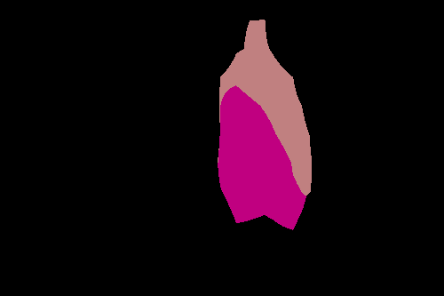
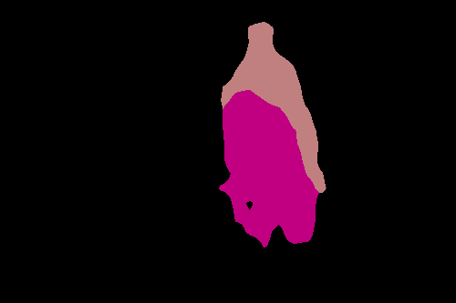
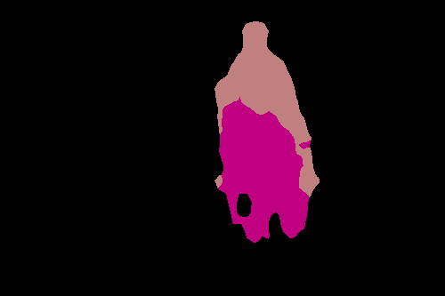

# Keras-FCN

This is a Keras implementation of the fully convolutional network outlined in <a href="https://arxiv.org/abs/1605.06211">Shelhamer et al. (2016)</a>, which performs semantic image segmentation on the Pascal VOC dataset.
My hope is that this document will be readable to people outside of deep learning, such as myself, who are looking to learn about fully convolutional networks.

In preparation, I found the following repos invaluable for reference:

https://github.com/shelhamer/fcn.berkeleyvision.org

https://github.com/fmahoudeau/FCN-Segmentation-TensorFlow/

https://github.com/aurora95/Keras-FCN

## Introduction

The goal of **semantic segmentation** is to identify objects, like cars and dogs, in an image by labelling the corresponding group of pixels as belonging to that class.
For an introduction, see <a href="https://nanonets.com/blog/semantic-image-segmentation-2020/">this article</a>.
As an example, below is an image and its pixel labels.

 

A **fully convolutional network (FCN)** is an artificial neural network that performs semantic segmentation. 
The bottom layers of a FCN are those of a convolutional neural network (CNN), usually taken from a pre-trained network like VGGNet or GoogLeNet.
The purpose of these layers is to perform classification on subregions of the image.
The top layers of a FCN are **transposed convolution/deconvolution** layers, which upsample the results of the classification to the resolution of the original image.
This gives us a label for each pixel.
When upsampling, we can also utilize the intermediate layers of the CNN to improve the accuracy of the segmentation.
For an introduction, see <a href="https://nanonets.com/blog/how-to-do-semantic-segmentation-using-deep-learning/">this article</a>.

The <a href="http://host.robots.ox.ac.uk/pascal/VOC/">Pascal VOC project</a> is a dataset containing images whose pixels have been labeled according to 20 classes, which include aeroplanes, cars, and people.
We will be performing semantic segmentation according to this dataset.

## Data

The number of images with labels is augmented by the <a href="http://home.bharathh.info/pubs/codes/SBD/download.html">Berkeley Segmentation Boundaries Dataset (SBD)</a>, which contains 11,355 labelled images.
However, there are 676 labelled images in the original Pascal VOC dataset that are missing from the SBD.
We have divided our data as follows:

- Training set: the SBD training set (8,498 images) + last 1,657 images (out of 2,857 total) of the SBD validation set + the 676 non-overlapping images of the Pascal VOC trainval set.
- Validation set: first 1,200 images (out of 2,857 total) of the SBD validation set

In total, we have 10,831 training samples and 1,200 validation samples.
The filenames of the training samples are found in <a href="https://github.com/kevinddchen/Keras-FCN/blob/main/data/train_mat.txt">data/train_mat.txt</a> and <a href="https://github.com/kevinddchen/Keras-FCN/blob/main/data/train_png.txt">data/train_png.txt</a>. 
The filenames of the validation samples are found in <a href="https://github.com/kevinddchen/Keras-FCN/blob/main/data/val_mat.txt">data/val_mat.txt</a>.
If you want to duplicate our dataset, you can download the <a href="https://github.com/kevinddchen/Keras-FCN/tree/main/data">data/</a> folder and the SBD dataset.
After untarring, place the contents of `benchmark_RELEASE/dataset/img` into <a href="https://github.com/kevinddchen/Keras-FCN/tree/main/data/images_mat">data/images_mat/</a> and `benchmark_RELEASE/dataset/cls` into <a href="https://github.com/kevinddchen/Keras-FCN/tree/main/data/labels_mat">data/labels_mat/</a>.

## Model

We follow the steps in the <a href="https://arxiv.org/abs/1605.06211">original paper by Shelhamer et al. (2016)</a>.
Our model details can be found in <a href="https://github.com/kevinddchen/Keras-FCN/blob/main/models.py">models.py</a>.

The data is downloaded directly from the Berkely SBD website and preprocessed into a TensorFlow Records files since the data cannot fit into RAM.
We use their training and validation set, which have sizes 8,498 and 2,857 respectively.
Note that this is different from what Shelhamer did.

The base CNN we use is VGG16.
First, the fully-connected layers are converted into convolutional layers.
Second, the final layer that predicts 1000 classes is replaced by a layer that predicts the 20 Pascal VOC classes.
Third, these predictions are fed into a transposed convolutional layer that upsamples 32x to the original resolution via bilinear interpolation.
This defines the **FCN32** network.

As previously mentioned, we utilize the intermediate layers of the CNN to improve the accuracy of the segmentation.
For the **FCN16** network, instead of upsampling 32x we first upsample 2x to get an output whose resolution matches that of the 'block4_pool' layer of VGG16.
We predict 20 classes from 'block4_pool' and add these two outputs together.
This is upsampled 16x to get to the original resolution.
A similar procedure is also done for the **FCN8** network, where we additionally include predictions from the 'block3_pool' layer of VGG16.

The training details can be found in <a href="https://github.com/kevinddchen/Keras-FCN/blob/main/train.ipynb">train.ipynb</a>.
We fine-tune the model by training the FCN32, FCN16, and FCN8 layers in turn, freezing deeper parts of the network that are harder to train.
Each model is trained for 10 epochs with the Adam optimizer at a fixed training rate of 1e-4, with $$L_2$$ regularization with strength 1e-5.

## Results

Below are the predicted labels for the example image.

|  |  |  |
| :--: | :--: | :--: |
| *FCN32* | *FCN16* | *FCN8* |

The performance of these models on the validation set are summarized below.
I did not bother with a testing set since I did not use anything like early stopping, but I agree this is not good practice.

| Model | Pixel Accuracy | Mean IoU |
| --- | --- | --- |
| FCN32 | 0.9282 | 0.5895 |
| FCN16 | 0.9285 | 0.5958 |
| FCN8 | 0.9320 | 0.6115 |

## Next Steps

I am quite happy with the performance of the models given the relatively simple implementation and short training period.
Although we tested on a different dataset, our performance is still not as good as Shelhamer's.
To get better performance, there are a couple of things that we can still do:

- Data set augmentation, such as cropping
- Complete training of models
- Use ensemble methods

When I have time, I will get to these.
