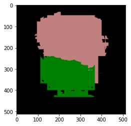

# Keras-FCN

This is a Keras implementation of the fully convolutional network outlined in Shelhamer et al. (2016), which performs semantic image segmentation on the Pascal VOC dataset.
My hope is that this document will be readable to non-technical persons, such as myself, who are looking to learn about fully convolutional networks.

## Introduction

The goal of **semantic segmentation** is to identify objects, like cars and dogs, in an image by labelling the corresponding pixels.
For a quick introduction, see <a href="https://nanonets.com/blog/semantic-image-segmentation-2020/">this article</a>.
As an example, below is an image and its pixel labels.

 

A **fully convolutional network (FCN)** is an artificial neural network that performs semantic segmentation. 
The bottom layers of a FCN are those of a convolutional neural network (CNN), usually taken from a pre-trained network like VGGNet or GoogLeNet.
The purpose of these layers is to perform classification on subregions of the image.
The top layers of a FCN are transposed convolutional layers, which upsample the results of the classification to the resolution of the original image.
This gives us a label for each pixel.
When upsampling, we can also utilize the intermediate layers of the CNN to improve the accuracy of the segmentation.
For a quick introduction, see <a href="https://nanonets.com/blog/how-to-do-semantic-segmentation-using-deep-learning/">this article</a>.

Below are the predicted labels for three FCNs, called FCN32, FCN16, and FCN8.

The <a href="http://host.robots.ox.ac.uk/pascal/VOC/">Pascal VOC project</a> is a dataset containing images whose pixels have been labeled according to 20 categories, which include aeroplanes, cars, people, and TVs.
The number of images with labels is augmented in the <a href="http://home.bharathh.info/pubs/codes/SBD/download.html">Berkeley Segmentation Boundaries Dataset</a>, which contains ~11k labelled images.

## Model

We follow the steps in the <a href="https://arxiv.org/abs/1605.06211">original paper by Shelhamer et al. (2016)</a>.
The model details can be found in <a href="https://github.com/kevinddchen/Keras-FCN/blob/main/models.py">models.py</a>

The base CNN we use is VGG16.
First, the fully-connected layers are converted into convolutional layers.
Second, the final layer that predicts 1000 classes is replaced with a layer that predicts 21 classes.
Third, these predictions are fed into a transposed convolutional layer that performs bilinear interpolation, upsampling x32 to the original resolution.
This defines the <i>FCN32</i> network.

As previously mentioned, we can utilize the intermediate layers of the CNN to improve the accuracy of the segmentation.
For the <i>FCN16</i> network, instead of upsampling x32, we upsample x2.
This gives us an output whose resolution matches that of the 'block4_pool' layer of VGG16.
Thus we can predict 21 classes from 'block4_pool' and add these two outputs together.
This is upsampled x16 to get to the original resolution.
A similar procedure is also done for the <i>FCN8</i> network, where we include information from the 'block3_pool' layer of VGG16 and the upsampling is x8.

The training details can be found in ???.
We pick the same training and validation set as Berkeley SBD.
When training, we fine-tune the model by first training the FCN32, FCN16, and FCN8 layers in turn, freezing parts of the network that are harder to train.
Each model is trained for 10 epochs at a fixed training rate of 1e-4 with the Adam optimizer and L2 regularization with strength 1e-5.
Afterwards, we unfreeze all layers and train for a further ??? epochs to arrive at our final model.

## Results
